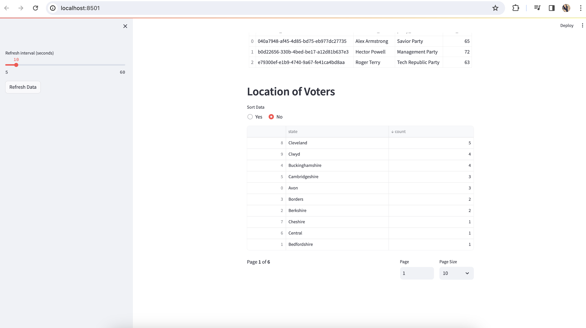

# Realtime Election Voting System

This collection houses the code for an election voting system that operates in real-time. Constructed with Python, Kafka, Spark Streaming, Postgres, and Streamlit, the system utilizes Docker Compose for effortless setup of necessary services within Docker containers.

## System Architecture


## System Flow


## System Components
- **main.py** :  This primary Python script is responsible for generating essential tables in PostgreSQL, namely `candidates`, `voters`, and `votes`. It also creates the Kafka topic and creates a copy of the `votes` table in the Kafka topic. It also contains the logic to consume the votes from the Kafka topic and produce data to `voters_topic` on Kafka.
- **voting.py** : This Python script hosts the logic for consuming votes from the Kafka topic (`voters_topic`), generating voting data, and transmitting this data to the `votes_topic` on Kafka.
- **spark-streaming.py** : This is the Python script that contains the logic to consume the votes from the Kafka topic (`votes_topic`), enrich the data from postgres and aggregate the votes and produce data to specific topics on Kafka.
- **streamlit-app.py** : This is the Python script that contains the logic to consume the aggregated voting data from the Kafka topic as well as postgres and display the voting data in realtime using Streamlit.


## System Setup

The `docker-compose.yml` file allows you to easily spin up Zookkeeper, Kafka and Postgres application in Docker containers.

### Prerequisites
- Python 3.9 or above installed on your machine
- Docker Compose installed on your machine
- Docker installed on your machine

### Steps to Run
1. Clone this repository.
2. Navigate to the root containing the Docker Compose file.
3. Run the following command:
```
docker-compose up -d
```

This command will start Zookeeper, Kafka and Postgres containers in detached mode (-d flag). Kafka will be accessible at localhost:9092 and Postgres at localhost:5432.

Additional Configuration
If you need to modify Zookeeper configurations or change the exposed port, you can update the docker-compose.yml file according to your requirements.

### Running the app
1. Install the required Python packages using the following command:
```
pip3 install -r requirements.txt
```
2. Creating the required tables on Postgres and generating voter information on Kafka topic:
```
python3 main.py
```
3. Consuming the voter information from Kafka topic, generating voting data and producing data to Kafka topic:
```
python3 voting.py
```
4. Consuming the voting data from Kafka topic, enriching the data from Postgres and producing data to specific topics on Kafka:
```
python3 spark-streaming.py
```
5. Running the Streamlit app:
```
streamlit run streamlit-app.py
```

## Screenshots

Streamlit dashboard screenshots





## Errors and Troubleshooting

Please set the appropriate spark config for the Spark-Kafka integration during its initialization.
For example, I was using the Spark version 3.5 and Scala version 2.12 and hence the config is set to use these specifications.

```
if __name__ == '__main__':
    spark = (SparkSession.builder
             .appName("ElectionAnalysis")
             .master("local[*]")  # Use local Spark execution with all available cores
             .config("spark.jars.packages",
                     "org.apache.spark:spark-sql-kafka-0-10_[2.12:3.5.0]")  # Spark-Kafka integration
             .config("spark.jars",
                     "postgresql-42.7.2.jar")  # PostgreSQL driver
             .config("spark.sql.adaptive.enabled", "false")  # Disable adaptive query execution
             .getOrCreate())
```

